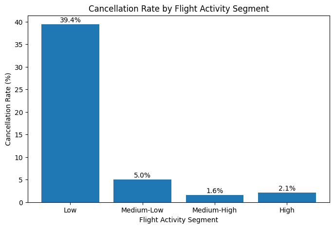
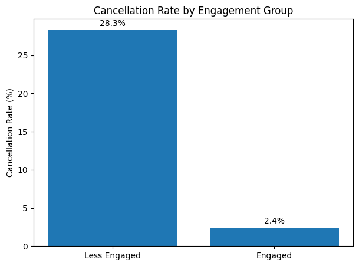
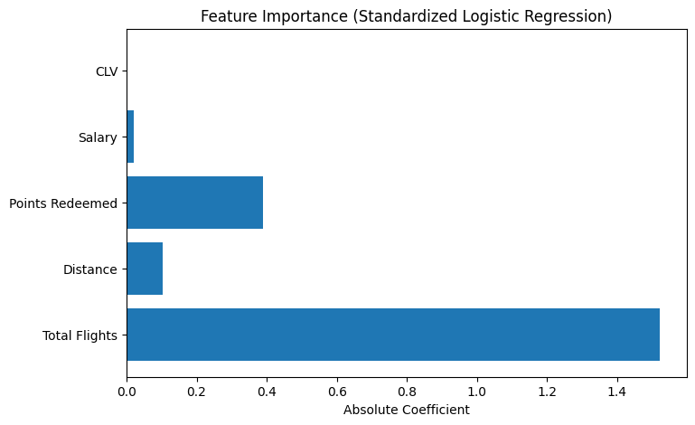

# From Customer Profiles to Customer Engagement: Explaining Churn in an Airline Loyalty Program

## Project Overview

I started this project with a simple question:

Why do some customers leave an airline loyalty program while others stay?

My initial assumption was that customer characteristics such as salary, loyalty card type, education level, or customer lifetime value would explain most of the differences.

As I worked through the data, I found a very different story. Customer engagement turned out to be much more important than customer profile information when trying to understand cancellations.

The goal of this project was to better understand what drives customer churn and identify the factors most closely associated with customer retention.

---

## Questions I Wanted to Explore

- Do customer profile variables explain churn?
- Are some customers more likely to cancel based on demographics or loyalty status?
- Does flight activity influence retention?
- Does reward redemption play a role?
- Can customer engagement help explain cancellations?

---

## Dataset

The analysis combines two datasets.

### Customer Loyalty History

Contains customer information such as:

- Gender
- Education
- Salary
- Marital Status
- Loyalty Card
- Customer Lifetime Value (CLV)
- Enrollment Information
- Cancellation Information

### Customer Flight Activity

Contains behavioral information such as:

- Total Flights
- Distance Traveled
- Points Accumulated
- Points Redeemed

---

## Tools Used

- Python
- Pandas
- NumPy
- Matplotlib
- Scikit-learn
- SQL
- Jupyter Notebook
- GitHub

---

## Key Findings

### Customer characteristics were not as important as I expected

One of the first things I looked at was customer profile information such as salary, education level, loyalty card type, and CLV.

I expected at least some of these variables to show meaningful differences between active and cancelled customers, but most of them turned out to be surprisingly similar across both groups.

### Flight activity was one of the strongest signals

The biggest differences started to appear when I looked at customer activity.

Customers who cancelled the program generally flew much less than active customers, and cancellation rates increased sharply among low-activity customers.

### Customers who never really use the program are much more likely to leave

One result that immediately caught my attention was the number of cancelled customers who never took a flight.

Nearly half of the customers who cancelled had no flight activity at all, which was much higher than I expected.

### Reward redemption seems to matter

Customers who redeemed points were much less likely to cancel than customers who never used their rewards.

This made me think that simply joining the program is not enough. Actually using its benefits appears to be much more important.

### Engagement was the clearest pattern in the data

The strongest result came from the engagement variable I created using flight activity and reward redemption.

Customers who actively used the program had a cancellation rate of only 2.4%, compared with more than 28% among less engaged customers.

---

## Visualizations

### Cancellation Rate by Flight Activity Segment



### Cancellation Rate by Engagement Group



### Feature Importance (Logistic Regression)



---

## Final Thoughts

The biggest surprise in this project was how quickly the analysis moved away from customer characteristics and toward customer behavior.

Several profile variables that I expected to matter ended up having very little relationship with cancellations.

Instead, the strongest patterns kept appearing in activity-related variables. Customers who flew more often, redeemed rewards, and actively used the program were much less likely to leave.

The finding that stayed with me the most was how many cancelled customers never took a flight at all. That result completely changed the direction of the analysis and eventually led to the engagement-focused approach used throughout the rest of the project.

---

## What I Would Do Next

If I continued this project, I would spend more time understanding what happens during a customer's first months in the program.

The results suggest that early engagement may play an important role in retention, so I would be interested in identifying what helps new members become active customers and what causes some of them to disengage so quickly.

---

## Repository Structure

```text
Airline-Loyalty-Churn-Analysis/

├── README.md
├── data/
├── sql/
│   └── churn_analysis.sql
├── notebooks/
│   └── What_Drives_Customer_Churn_in_an_Airline_Loyalty_Program_.ipynb
└── images/
    ├── flight_activity_churn.png
    ├── engagement_churn.png
    └── feature_importance.png
```

---

## Author

Fernando
